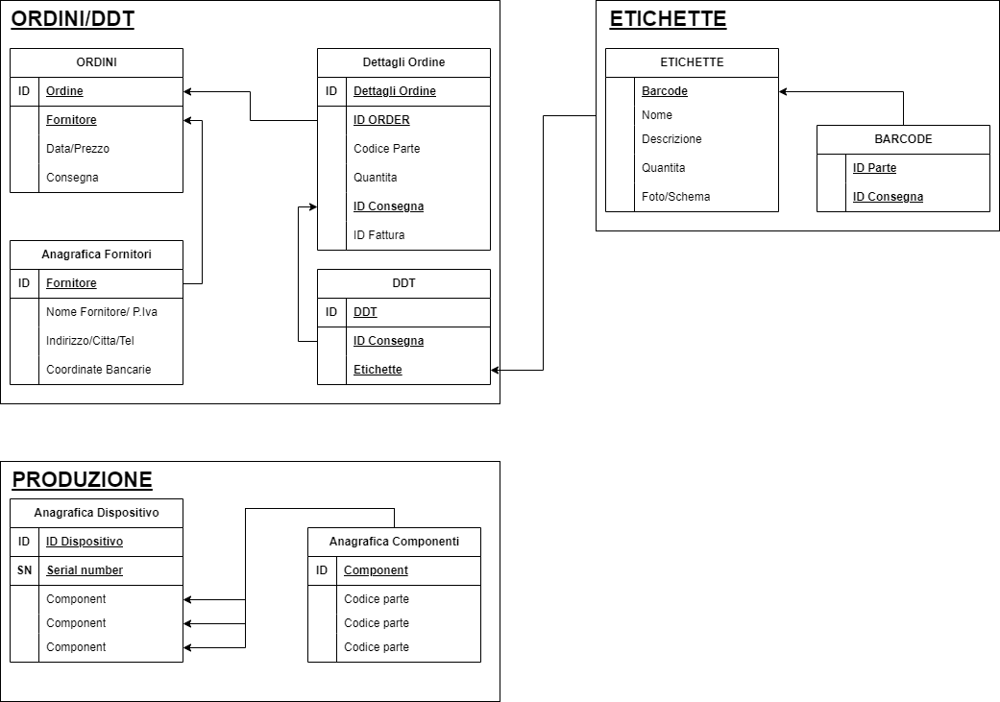
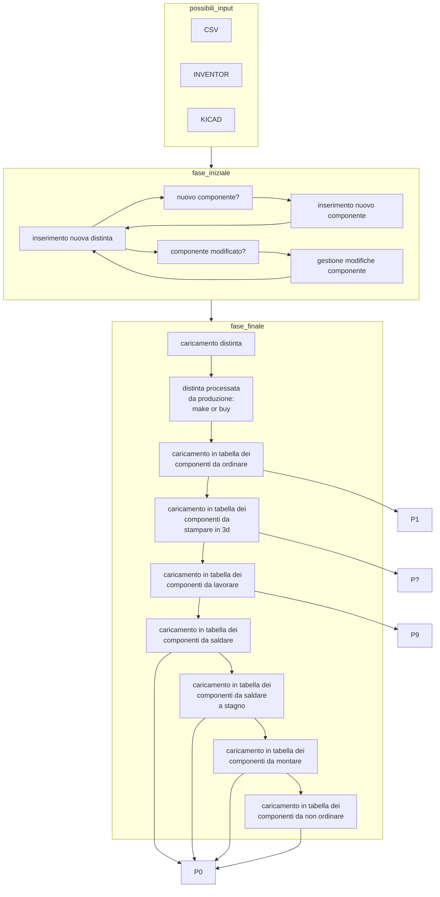
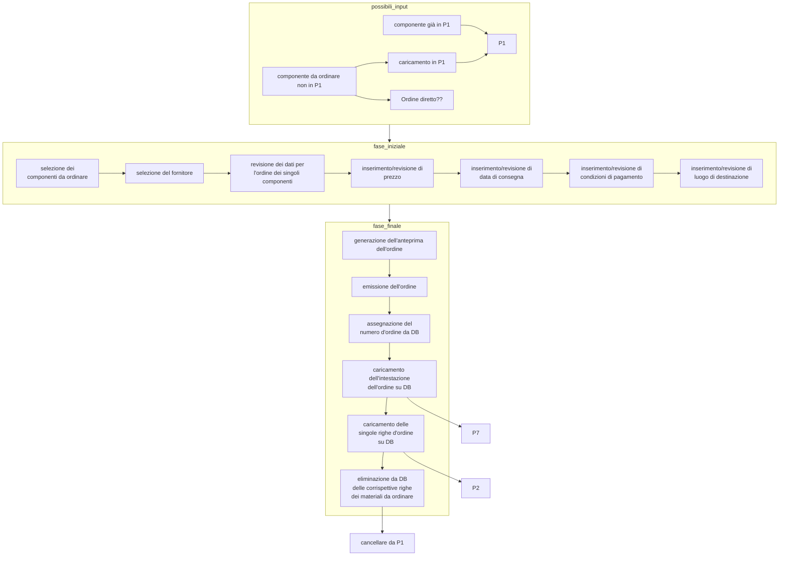

# Roadmap

<figure><figcaption><p>Roadmap Rev0_1</p></figcaption></figure>



Schema dell'inserimento componenti/distinta



Schema della creazione ordini



Schema della ricezione ordini

```mermaid
```
