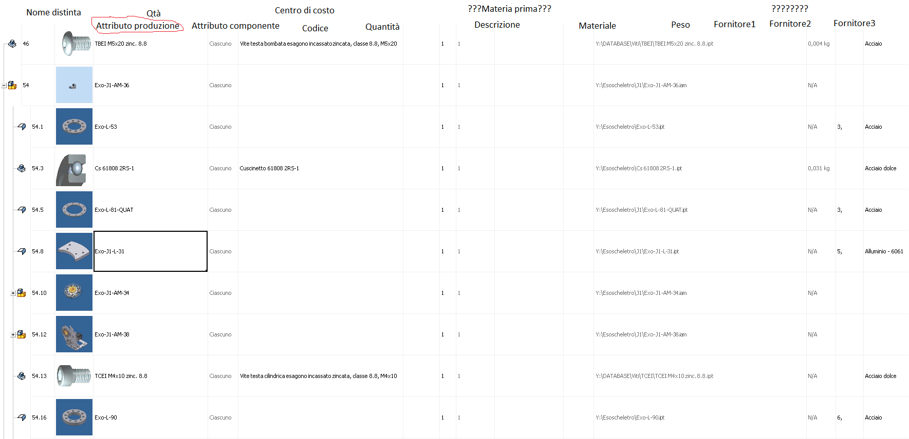

# Processa Distinta

La pagina prevede 2 pulsanti Save e Processa. Ci saranno anche dei pulsanti per delle macro (Applica tutti i fornitori preferenziali, etc)

Il punsante Processa è bloccato se non sono stati inseriti tutti i campi Attributi Produzione.

Entrambi i pulsanti sono bloccati se il campo processata in b3 è 1.

Usare elemento TreeView con possibilità di aprire e chiudere i "figli" e visualizzare i Thumbnail

Si può cambiare Attributo produzione e Fornitore. Entrambi vengono salvati nella tabella b4

Da capire gestione materia prima e date di consegna

Attributo produzione è un drop down menù che dipende da attributo componente (sql select attributo\_produzione from p4\_attributo\_produzione where p4\_attributo\_produzione.rif\_attributo\_anagrafica= anagrafica\_componenti.rif\_attributo\_anagrafica or p4\_attributo\_produzione.rif\_attributo\_anagrafica is null)

Fornitore è un dropdown menù che filtra i fornitori dalla tabella agenda con bit fornitore = 1. L'ideale sarebbe avere come suggeriti i fornitori della tabella anagrafica\_componenti\_fornitori\_preferenziali filtrati per il codice componente corrispondente, come da immagine allegata.

<figure><figcaption></figcaption></figure>

Attributo produzione è un drop down menù che dipende da attributo componente (sql select attributo\_produzione from p4\_attributo\_produzione where p4\_attributo\_produzione.rif\_attributo\_anagrafica= anagrafica\_componenti.rif\_attributo\_anagrafica or p4\_attributo\_produzione.rif\_attributo\_anagrafica is null)

<figure><figcaption></figcaption></figure>

1. Se un componente ha attibuto Ordinare, Non ordinare e Magazzino tutti i figli di quel componente sono nascosti e bloccati. Non devono più essere considerati.

