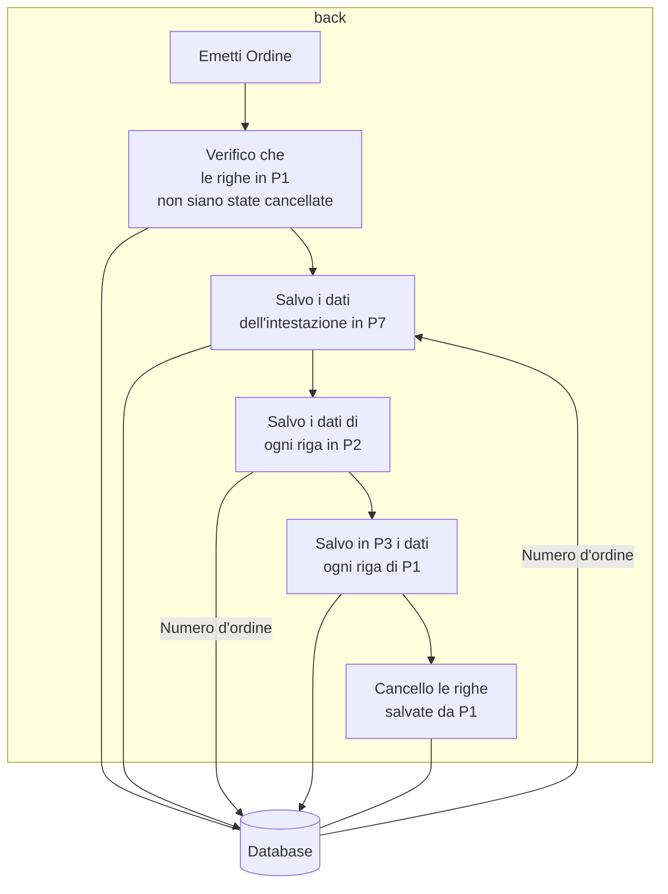

# Creazione ordine

All'apertura della pagina vengono caricate tutte le righe in p1 con fornitore 1, 2 o3 uguale a quello selezionato.

Come data di consegna viene inserita la più recente tra le date di consegna richieste.

I campi codice fornitore, descrizione fornitore, prezzi sono caricati dalla tabella anagrafica\_componenti\_fornitori\_preferenziali se esistono.

Nella visualizzazione si dovrebbero poter vedere i campi della tabella anagrafica\_componenti\_fornitori\_preferenziali. Valutare se aggiungerli all'elenco o creare un box dedicato alla sola visualizzazione.

<figure><figcaption></figcaption></figure>

Campi da poter modificare:

* Codice fornitore
* Descrizione fornitore
* Prezzo
* Unita di misura
* Quantità extra
* Quantità magazzino

ll pulsante Aggiungi riga d'ordine apre la Creazione nuova riga d'ordine.

Il pulsante Anteprima crea una bozza PDF di ordine tramite Latek.

Il pulsante Emetti Ordine prima salva i dati a database come da schema sotto riportato e successivamente, se tutto ha avuto successo, genera il PDF tramite Latek. Dopo aver emesso l'ordine un pop-up chiede se aggiornare la tabella anagrafica\_componenti\_fornitori\_preferenziali con i dati dell'ordine.

Va aggiunto anche un pulsante Aggiorna che ricalcola quantita e i prezzi totali e se ci sono date di consegna richieste precedenti alla data di consegna decisa, evidenzia in giallo sia la data di consegna che le data di consegna richieste non rispettate.&#x20;
