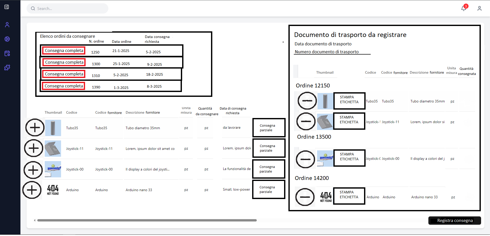
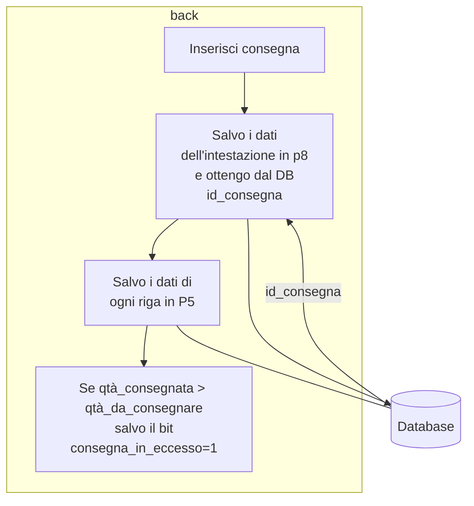

# Inserimento nuova consegna

All'apertura della pagina vengono caricate nel box "Elenco ordini da consegnare" tutte le righe in view\_p7\_ordini\_non\_consegnati con fornitore uguale a quello selezionato.

<figure><figcaption></figcaption></figure>

Lo scopo della pagina è ricreare a destra la "versione digitale" del documento di trasporto che si sta registrando.

Va inserito in alto a destra la data e il numero del documento di trasporto ricevuto.

A sinistra è possibile selezionare l'ordine da consegnare o cliccare sul pulsante consegna completa.

In caso di selezione nella parte bassa a sinistra vengono caricate dalla vista view\_p2\_materiali\_non\_consegnati le righe relative all'ordine selezionato.

Per ogni riga d'ordine è possibile cliccare sul pulsante + o sul pulsante consegna parziale. Il pulsante consegna parziale apre un pop-up in cui è possibile inserire la quantità ricevuta( tale quantità non può essere negativa e se è superiore a quella ordinata va evidenziata in rosso.

Quindi le tre modalità per riempire la parte di destra sono:&#x20;

-pulsante consegna completa dell'ordine

-pulsante + consegna completa riga d'ordine

-pulsante consegna parziale riga d'ordine

Tutte queste modalità hanno l'effetto di riempire il box di destra e di disabilitare o nascondere nei box di sinistra ciò che è stato inserito.\
Nel box di destra c'è anche il pulsante "ETICHETTA" o "STAMPA ETICHETTA". Ha lo scopo di stampare l'etichetta del componente. Le specifiche di tale etichetta sono in [https://app.gitbook.com/o/iDtGkRd2HQPQZGrX8UvF/s/TvqB8mdmJWaZnZV29zYg/\~/changes/14/tracciabilita/etichette-per-materiale-consegnato](https://app.gitbook.com/o/iDtGkRd2HQPQZGrX8UvF/s/TvqB8mdmJWaZnZV29zYg/~/changes/14/tracciabilita/etichette-per-materiale-consegnato)

&#x20;Il pulsante inserisci consegna ha il seguente effetto.

Dopo l'inserimento il sistema apre direttamente la pagina "Visualizza consegna" appena inserita all'interno della sezione Elenco consegne.
